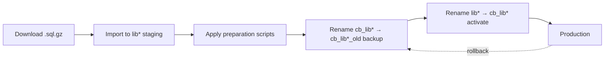

# Database Update Scripts Documentation

## Overview

The `db_init/scripts` directory contains automated scripts for updating the Flibusta MariaDB database from remote backups. The system uses an atomic table naming convention to ensure zero-downtime updates with instant rollback capability.

> **Note:** All scripts use relative path detection. They automatically determine the project directory from the script location, so no hardcoded paths are required.

---

## Crontab Configuration

Adjust the paths below to match your actual installation:

```cron
1 3 * * * <PATH_TO_PROJECT>/db_init/scripts/update_all_tables.sh > <PATH_TO_PROJECT>/logs/flibusta_db_update_$(date +\%Y-\%m-\%d).log 2>&1
```

Example (replace with your actual path):
```cron
1 3 * * * /opt/flibusta_bot/db_init/scripts/update_all_tables.sh > /opt/flibusta_bot/logs/flibusta_db_update_$(date +\%Y-\%m-\%d).log 2>&1
```

Runs daily at 03:01 AM, logging output to dated files.

---

## Table Lifecycle

The system maintains three table states:

| State | Prefix | Purpose |
|-------|--------|---------|
| **Staging** | `lib*` | Temporary tables loaded from downloaded backups |
| **Production** | `cb_lib*` | Active tables used by the bot |
| **Backup** | `cb_lib*_old` | Previous version for rollback |

### Workflow



---

## Configuration Files

### [`tables.conf`](db_init/scripts/tables.conf)

Maps table names to backup filenames from flibusta.is:

```bash
libbook=lib.libbook.sql.gz
libavtor=lib.libavtor.sql.gz
# ... etc
```

### [`tasks.conf`](db_init/scripts/tasks.conf)

Defines the update workflow sequence:

```bash
cleanup_sql_files
download_sql_files
load_sql_to_lib_tables
apply_preparation_scripts
activate_cb_tables
process_libbook_fts
# ensure_containers_healthy  # disabled by default
```

---

## Core Scripts

### Main Entry Point

#### [`update_all_tables.sh`](db_init/scripts/update_all_tables.sh)

Orchestrates the complete update workflow by executing tasks defined in [`tasks.conf`](db_init/scripts/tasks.conf). Uses environment variables:

| Variable | Default | Description |
|----------|---------|-------------|
| `FLIBUSTA_DB_DIR` | auto-detect | Base directory (derived from script location) |
| `FLIBUSTA_DB_CONTAINER` | `flibusta-db` | Docker container name |
| `FLIBUSTA_DB_USER` | `flibusta` | Database user |
| `FLIBUSTA_DB_PASS` | `flibusta` | Database password |
| `FLIBUSTA_DB_NAME` | `flibusta` | Database name |
| `FLIBUSTA_SQL_URL_BASE` | `https://flibusta.is/sql/` | Backup source URL |

All scripts detect their base directory automatically:

```bash
# This pattern is used in all scripts:
: "${FLIBUSTA_DB_DIR:=$(cd "$(dirname "$0")/.." && pwd)}"
```

---

## Atomic Scripts

### [`download_backup.sh`](db_init/scripts/download_backup.sh)

Downloads a single table's backup from flibusta.is.

```bash
./download_backup.sh <table_name>
```

### [`restore_to_lib.sh`](db_init/scripts/restore_to_lib.sh)

Imports downloaded `.sql.gz` file into a `lib*` staging table.

```bash
./restore_to_lib.sh <table_name>
```

### [`rename_table.sh`](db_init/scripts/rename_table.sh)

Renames database tables with safety checks. Only allows specific transitions:

- `lib*` → `cb_lib*` (activation)
- `cb_lib*` → `cb_lib*_old` (backup)
- `cb_lib*` → `lib*` (restore step 1)
- `cb_lib*_old` → `cb_lib*` (restore step 2)

```bash
./rename_table.sh <from_table> <to_table>
```

### [`drop_old_table.sh`](db_init/scripts/drop_old_table.sh)

Safely drops backup tables. Only accepts `cb_*_old` pattern.

```bash
./drop_old_table.sh <table_name>
```

### [`cleanup_sql_file.sh`](db_init/scripts/cleanup_sql_file.sh)

Removes downloaded `.sql.gz` file after successful import.

```bash
./cleanup_sql_file.sh <table_name>
```

---

## Utility Scripts

### [`update_single_table.sh`](db_init/scripts/update_single_table.sh)

Updates a single table independently (useful for testing or manual updates):

```bash
./update_single_table.sh <table_name>
```

Steps:
1. Cleanup old SQL file
2. Drop old backup table
3. Download backup
4. Restore to lib table
5. Backup current cb_* → cb_*_old
6. Activate new lib* → cb_*

### [`rollback_all_tables.sh`](db_init/scripts/rollback_all_tables.sh)

Reverts all tables to previous state by renaming:
- `cb_lib*` → `lib*`
- `cb_lib*_old` → `cb_lib*`

### [`ensure_containers_healthy.sh`](db_init/scripts/ensure_containers_healthy.sh)

Restarts Docker containers and waits for health checks (disabled by default in tasks.conf).

---

## Preparation SQL Scripts

Executed by [`update_all_tables.sh`](db_init/scripts/update_all_tables.sh) via `apply_preparation_scripts` task:

| Script | Purpose |
|--------|---------|
| `zz_10_convert_charset.sql` | Normalize charset to utf8mb3 |
| `zz_20_create_indexes.sql` | Create performance indexes |
| `zz_30_create_FT_indexes.sql` | Create FULLTEXT indexes |
| `zz_40_fill_FT.sql` | Populate libbook_fts search table |
| `zz_56_db_statistics.sql` | Display final DB statistics |

---

## Optimized Version

### [`update_all_tables.sh.new`](db_init/scripts/update_all_tables.sh.new)

Parallel-optimized version with:
- Concurrent downloads (default: 2 parallel jobs)
- Parallel SQL imports to prevent RAM exhaustion
- Automatic file cleanup after import to save disk space

To enable: replace `update_all_tables.sh` with this version.

---

## Usage Examples

### Manual full update

```bash
cd <PATH_TO_PROJECT>/db_init/scripts
./update_all_tables.sh
```

### Single table update

```bash
cd <PATH_TO_PROJECT>/db_init/scripts
./update_single_table.sh libbook
```

### Rollback to previous version

```bash
cd <PATH_TO_PROJECT>/db_init/scripts
./rollback_all_tables.sh
```

### Check container health

```bash
cd <PATH_TO_PROJECT>/db_init/scripts
./ensure_containers_healthy.sh
```

---

## Log Output

Logs are written to (adjust path to your project):

```
<PATH_TO_PROJECT>/logs/flibusta_db_update_YYYY-MM-DD.log
```

Example:
```
/opt/flibusta_bot/logs/flibusta_db_update_2026-03-09.log
```

Each task logs with timestamp:
```
2026-03-09 03:01:15 - 📥 Starting task: Download SQL files...
2026-03-09 03:01:16 - ✅ Downloaded lib.libbook.sql.gz successfully
```
